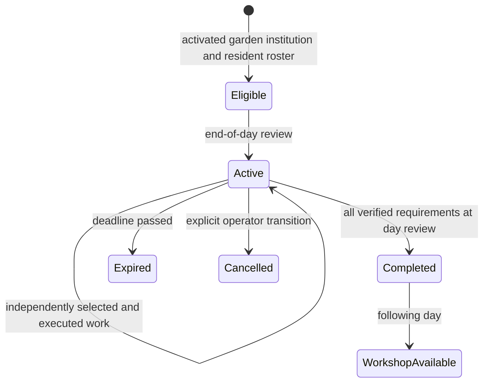

# V9: evidence-backed collective civic projects

V9 implements one complete collective project: an activated Community Garden
stewardship institution sponsors preparation of a garden learning program.
Independent residents choose work sessions through ordinary activity arbitration.
Verified completion enables an ongoing garden workshop activity from the next day.
The workshop satisfies knowledge needs and participates in subsequent location and
social scheduling. There is no new daily event, currency, inventory or job authority.

## Reproduce

```bash
python scripts/evaluate_v9_collective_projects.py --output /tmp/llm-town-v9
cat /tmp/llm-town-v9/walkthrough.txt
python scripts/inspect_town.py trace /tmp/llm-town-v9/uninterrupted.json \
  --type project --id civic-project:garden_learning --format text
```

No model, GPU or network is required. Without `--output`, the evaluator uses and
removes a temporary directory. The selected directory contains generated saves,
logs, configuration, JSON reports and a narrative derived only from verified
records. Do not commit these files. Use a dedicated directory: named output files
are replaced when the demonstration is rerun.

The executed seed-11, 100-day scenario activates the institution and project on
day 70. Residents `agent_005`, `agent_004`, `agent_003` and `agent_001` contribute
on days 72, 75, 82 and 84. Completion on day 84 enables the workshop from day 85;
six subsequent sessions execute. These dates are evaluation observations, not
hardcoded scheduling rules. The evaluator derives its four checkpoints from
actual project state, independently reconstructs each checkpoint, and verifies
matching authoritative results. It also presents an incomplete checkpoint and
rejects forged actor evidence.

## Baseline and ownership decisions

This implementation is stacked on open PR #5, `v8-causal-inspection`, at
`83a99244b6df19f876a43b5953681c7045c2d936`. Remote main was
`cd55b2c40c37d078b2d6ae9df705405f141155cc`. PR #5 was neither merged nor copied.
Its inspection and inherited V7 test repair are integration dependencies.

V3 commitments already distinguish proposal, acceptance, preparation and executed
fulfillment. V4 plans and goals already bind strategy activities to their actor,
dependencies and execution records. These are individual obligations and plans;
an agreement is not work performed. V5/V6 already own finite location activation,
institution formation, employment/startup funding, commerce registration,
procedural template admission, and one daily event per day. V8 observes typed
persisted authority without constructing or mutating a simulation.

A small `CollectiveProjectSystem` owns project-specific work evidence and lifecycle.
It does not replace these systems. Extending commitments to treat promises as
contributions would violate their authority boundary. Extending institution
formation to aggregate work and activate future learning would mix startup and
post-formation responsibilities. General world generation, funding drives,
material donations and a generic project DSL were deliberately excluded.

| Owner | Responsibility |
| --- | --- |
| Institution and location growth | Existing activation and registration authority |
| Project system | Eligibility binding, immutable project/contribution/effect records, bounded offers, review |
| Activity planner | Resident arbitration among ordinary work, needs, intents, commitments and events |
| Activity executor | Actual offered activity, resident movement, execution log, need effects, project credit |
| Simulation loop | End-of-day review after growth; no retroactive opportunity |
| Persistence | Save project authority and opt-in activity random stream; validate before restoration |
| Causal inspector | Pure contract verification, exact references, bounded public reporting |

## Finite product contract

The only template is `garden_learning`. The only sponsor key is
`community_garden_stewardship` at the activated `community_garden` location.
The project ID is `civic-project:garden_learning`; one project may ever form.
No numerical project/contribution ID counters exist to rewind or jump.

Eligibility requires an activated institution, exact formation/institution/place
binding, and at least the required number of residents. Its sorted eligibility
roster is persisted at activation (at most the first 64 resident IDs). Later
arrivals do not retroactively join this project's roster. The engine validates
existing institutional, economy and material authority before binding projects.

Opt in through an existing town growth configuration:

```json
"collective_projects": {
  "enabled": true,
  "required_units": 4,
  "minimum_residents": 2,
  "lifetime_days": 21,
  "daily_capacity": 1
}
```

The existing config is disabled by omission. Unknown configuration fields and
unsupported templates/resource amounts are rejected. Requirements are integers,
excluding booleans: 2–16 sessions, 2–8 residents (at most required sessions),
2–60 days of lifetime and 1–4 work sessions per project per day. At least two
work days are always required. Each resident may contribute once per day. Final
slots are reserved when needed for another resident or another day, so accepted
work cannot exhaust the budget while making the participation contract impossible.

## Execution and lifecycle



`civic_garden_prepare` is a supported work-session activity at the garden. Offers
are optional ordinary candidates for residents with social, knowledge or community
needs after existing commitment/intent/event arbitration. Authoritative employment
may still win ordinary choices; it does not overwrite a selected civic activity.
No named resident is forced to participate. A wealth-focused or otherwise occupied
population can leave a project incomplete and eventually expire it.

The executor accepts only the exact resident object, exact offered activity object
and exact appended activity record. It validates actor, project/effect, place,
clock, action type, offer metadata and remaining capacity again at execution.
Copies, changed offers, stale offers, narrative claims and another resident's
records cannot supply work. Same-tick stale offers cannot bypass work or workshop
capacity. Work sessions run in the existing resident execution order; evidence
is sorted canonically by day/hour/actor without changing execution arbitration.
Crime and commitment social processing retain their existing end-of-tick boundary.

A contribution is immutable, one unit, and binds actor/project/location/day/hour
to the exact activity-list index and deterministic execution key. It has no
LLM-controlled amount or progress counter. Progress is the verified evidence set.
Intention, dialogue, agreement and a scheduled but unexecuted activity provide
zero progress. Re-executing an offer or reviewing an already processed day cannot
create more evidence or another effect.

Review completes a project only after every work, distinct-resident and
distinct-day requirement is met. Deadline day remains usable; an unfinished
project expires on deadline + 1. Explicit cancellation is a bounded operator API,
not a resident or dialogue authority. Terminal records are immutable replacements;
terminal replay cannot reopen a project. Completion creates exactly one immutable
`civic-effect:garden_learning`, available on resolution day + 1.

`civic_garden_workshop` becomes an ordinary learning candidate at the same active
location. It executes at most once per town tick and has the existing knowledge
and learning need effects. Each execution carries the effect ID and a civic
execution key. Expiration, cancellation and incomplete work grant no workshop.
The project invokes no monetary/material transaction APIs, so there are no new
multi-system transfers or partial resource commits to roll back.

## Persistence and independent continuation

The optional `collective_projects` save section has strict schema version 1:
policy, projects, contributions, effects and last reviewed day. Restoration checks
exact field sets, types, capacities, identities, eligibility witnesses, canonical
ordering, actor/day uniqueness, timestamps, exact activity references, full work
requirements, terminal chronology and the single effect. Verified work history
must reconcile one-to-one with contribution records. Removing a contribution or
its execution fails closed. Workshop records require the completed project's
effect, future availability and tick capacity. Review chronology must agree with
the saved day and whether its final review already occurred.

Enabled saves also retain `v9_random_state` version 1, containing the existing
Python MT activity arbitration state. An isolated generator validates its bounded
shape before restoration changes the process stream. This permits reconstruction
in a fresh process with an unrelated initial random seed. It leaves disabled
save shape and arbitration unchanged. As with the existing simulation, multiple
simultaneously running engines in one process share Python's random stream; run
independent continuations separately or in separate processes.

Legacy saves with neither section and no civic execution claims take an explicit
compatibility path: no historical project or evidence is fabricated. After opt-in,
the next completed-day review may recognize an eligible institution. Present
malformed/null sections, missing arbitration state on V9 saves, contradictory
policy and disabled-policy saves containing civic authority are rejected. Missing
project authority cannot be reconstructed from memories or dialogue. Reordering
or pruning activity history without preserving its evidence indices is not a
supported V9 migration; it fails closed.

The evaluator compares deterministic systems (economy, materials, migration,
locations, events, institutions, commerce, projects, crime, justice, commitments,
plans and procedural growth), selected activity authority, relationship scores,
public goal/intent/arc state,
resident needs/locations and daily event identities. It excludes legacy UUID-bearing
private memories and narrative. This is authoritative equivalence, not byte equality
of entire saves. Inspection additionally compares independently reconstructed
project traces. Unit and integration checks cover formation, one contribution,
pre-review completion, completed effects, replay and corrupted saves.

## Inspection and bounds

Existing V7 timeline/show/compare source contracts remain compatible. V8 typed
tracing adds `project`, `contribution`, `project_effect` and `civic_activity`.
Exact work executions link to contributions, which link to progress; verified
completion links to the effect and subsequently executed workshop activities.
A bounded project audit reports requirements, verified counts and a controlled
completion/pending/expiration/cancellation reason. Missing or contradictory evidence
withholds civic edges; duplicate typed identities and unsafe input fail closed.

Eligibility links require V8's independent startup-funding and exact location
ancestry verification. Original
institution formation's missing historical readiness witnesses remain unresolved;
V9 does not turn them into proof or erase that diagnostic. Shared dates, locations,
participants and prose remain associations, never substitute causal evidence.
Inspection imports no engine or LLM and never invokes project transitions. It
retains V8 input budgets, 4 MiB output bound, typed identity, deterministic signatures
and privacy allowlists. Internal consistency is not cryptographic file authenticity.

Project memory is bounded to one project, at most 16 contributions, one effect and
at most 64 current-tick offers. Work selection scans at most 16 contributions.
Workshop capacity scans only the trailing current-tick activity group, not the
entire town history. Restoration/inspection scan existing admitted histories.
Workshop evidence adds fields to existing activity records rather than a second
unbounded event history. Existing whole-save growth remains an upstream limitation.

## Limits

One garden project, one finite work activity and one learning consequence are
implemented. There are no donations, money budgets, factions, membership elections,
project negotiations, retries after terminal failure, arbitrary templates or UI.
No commitment or goal is required to motivate participation. Current institution
and location authority are monotonic; V9 does not introduce their contraction.
Cancellation is an explicit API, not a CLI workflow. Genuine resident arbitration
can fail to complete a project; the seeded demonstration is evidence of a working
trajectory, not a guarantee for all seeds. Existing V6 thresholds and freeze
semantics were not changed.
